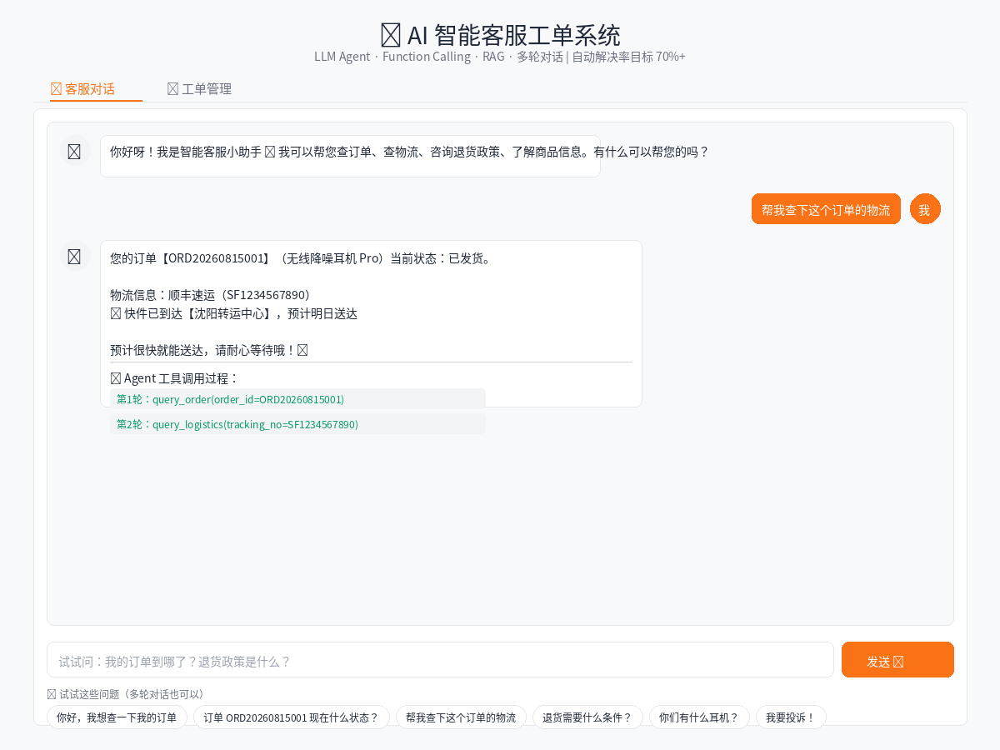
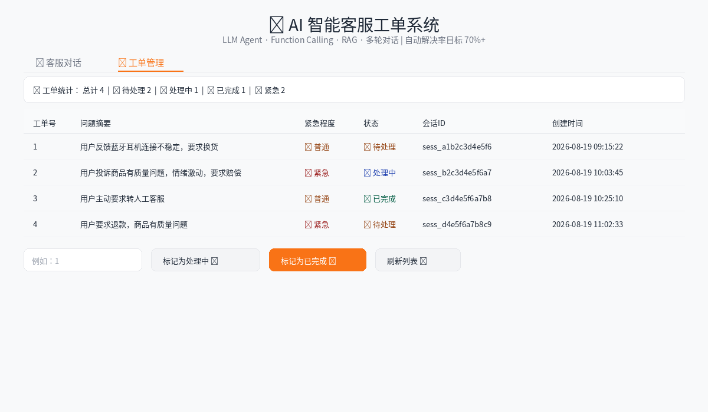

# 🤖 AI 智能客服 Agent 系统

> 基于大模型 Function Calling + RAG 的企业级智能客服 Agent，自动处理 70%+ 重复性咨询，复杂问题智能转人工。

[](https://www.python.org/)
[](https://fastapi.tiangolo.com/)
[](https://www.deepseek.com/)
[]()
[](https://www.gradio.app/)
[](https://www.docker.com/)

## 📖 项目简介

本项目是一个面向企业客服团队的 **AI Agent 系统**。与传统的规则匹配客服不同，它基于大语言模型的 **Function Calling** 能力，让 AI 自主理解用户意图、决定调用哪个工具、执行多步推理，最终给出准确回答。遇到投诉、退款等复杂问题，自动创建工单转接人工。

**核心能力**：LLM Agent · Function Calling · RAG 知识检索 · 多轮对话 · 自动工单


## 📸 效果预览

### 客服对话页


> 用户发送消息后，Agent 自动调用工具查询订单和物流，并在回复下方展示完整的工具调用链路。

### 工单管理页


> 转人工后自动生成工单，支持状态流转（待处理 → 处理中 → 已完成）和统计概览。

## ✨ 核心功能

| 能力 | 实现方式 |
|------|---------|
| 🧠 **Agent 推理** | ReAct 架构：思考 → 调用工具 → 观察结果 → 生成回复 |
| 🔧 **Function Calling** | 5 个工具函数，AI 自主决策调用，支持多步串联调用 |
| 📚 **RAG 知识检索** | 政策文档分块索引 + TF-IDF 相似度检索，动态注入 Prompt |
| 💬 **多轮对话** | Session 管理 + 历史消息持久化，支持上下文连续交互 |
| 🎫 **智能工单** | 三层转人工机制 + 紧急程度自动分级 + 状态流转 |
| 📊 **工具链路追踪** | 每次对话记录完整的 tool_call 链路，便于调试和审计 |
| 🐳 **Docker 部署** | 一键容器化部署 |

## 🏗️ 系统架构

```
┌──────────────────────────────────────────────────────┐
│                    用户浏览器                          │
│              Gradio UI (Port 7860)                   │
├──────────────────────────────────────────────────────┤
│   💬 客服对话页              │   📋 工单管理页        │
│   - 多轮聊天                 │   - 工单列表           │
│   - 工具调用过程展示         │   - 状态流转           │
│   - 快捷问题                 │   - 统计面板           │
└──────────────┬───────────────────────┬───────────────┘
               │                       │
               ▼                       ▼
┌──────────────────────────────────────────────────────┐
│           FastAPI 后端 (Port 8000)                   │
│   POST /chat  ·  GET /tickets  ·  PUT /tickets/:id   │
└──────────────┬───────────────────────────────────────┘
               │
               ▼
┌──────────────────────────────────────────────────────┐
│              🤖 Agent 核心 (ReAct Loop)               │
│                                                      │
│  ① RAG 检索知识库 → ② 构建 System Prompt             │
│  ③ 加载对话历史   → ④ LLM 推理 (DeepSeek)             │
│     │                                                │
│     ├── 需要工具？→ 执行 Function → 结果回传 → ④循环  │
│     ├── 转人工？  → 创建工单 → 返回用户              │
│     └── 最终回复  → 保存对话 → 返回前端              │
└──────┬───────────┬───────────────┬───────────────────┘
       │           │               │
       ▼           ▼               ▼
┌────────────┐ ┌──────────┐ ┌─────────────┐
│  🔧 Tools  │ │ 📚  RAG  │ │ 🗄️  SQLite  │
│            │ │          │ │             │
│ query_order│ │ 文档分块  │ │ sessions    │
│ query_log. │ │ TF-IDF   │ │ tickets     │
│ query_prod │ │ 相似度   │ │ conversat.  │
│ calc_return│ │ 检索     │ │ (tool_trace)│
│ escalate   │ │ Top-K    │ │             │
└────────────┘ └──────────┘ └─────────────┘
       │
       ▼
┌────────────────────┐
│  📦 mock_data.py   │
│  用户/订单/物流/商品│
│  (生产环境替换为    │
│   真实业务 API)     │
└────────────────────┘
```

## 🔧 Agent 工具集（Function Calling）

AI 根据用户意图自主选择调用以下工具：

| 工具 | 功能 | 触发场景示例 |
|------|------|-------------|
| `query_order` | 查询订单（按单号或列出全部） | "我的订单到哪了"、"ORD20260815001 什么状态" |
| `query_logistics` | 查询物流轨迹 | "快递到哪了"、"什么时候送到" |
| `query_product` | 搜索/查询商品 | "有什么耳机"、"T恤有什么尺码" |
| `calculate_return` | 估算退货退款 | "这个能退多少钱"、"退货怎么操作" |
| `escalate_to_human` | 转人工客服 | "我要投诉"、"转人工"、AI 无法解决时 |

工具支持**多步串联调用**，例如：
> 用户："我买的那个耳机能退吗"
> → AI 调 `query_order` 找到耳机订单
> → AI 调 `calculate_return` 评估退款
> → AI 结合 RAG 检索的退货政策 → 综合回复

## 🧠 RAG 知识库

`knowledge_base/` 目录下的 Markdown 文档会被自动分块索引：

```
knowledge_base/
├── 退换货政策.md      # 七天无理由、运费规则、退款时效
├── 常见问题.md        # 订单、支付、配送、会员 FAQ
└── 产品与售后.md      # 保修、价保、联系方式
```

检索流程：文档按标题层级分块 → 中文 2-gram 分词 → TF-IDF 向量化 → 余弦相似度匹配 → Top-3 段落注入 System Prompt。

## 🔄 三层转人工机制

```
用户消息
   │
   ├─① 关键词拦截（零延迟）
   │   投诉/赔偿/律师/315/举报 → 立即创建紧急工单
   │
   ├─② Agent 自主判断（LLM 决策）
   │   AI 调用 escalate_to_human 工具
   │   → 覆盖关键词未命中的复杂场景
   │
   └─③ 异常兜底（高可用）
       API 超时/限流/错误 → 自动转人工
```

## 📁 项目结构

```
ai-customer-service/
├── .env.example                # 环境变量模板
├── .gitignore                  # Git 忽略规则
├── requirements.txt            # Python 依赖
├── Dockerfile                  # Docker 镜像构建
├── docker-compose.yml          # Docker Compose 一键启动

## 🚀 快速开始

### 方式一：Docker Compose 一键启动（推荐）

```bash
git clone https://github.com/BD0220/ai-customer-service.git
cd ai-customer-service

# 配置 API Key
cp .env.example .env
# 编辑 .env，填入 DEEPSEEK_API_KEY

# 一键启动
docker-compose up -d

# 查看日志
docker-compose logs -f
```

启动后访问：
- 前端界面：http://localhost:7860
- API 文档：http://localhost:8000/docs

停止服务：`docker-compose down`

### 方式二：本地 Python 运行

#### 环境要求
- Python 3.10+
- [DeepSeek API Key](https://platform.deepseek.com/)

#### 安装与配置

```bash
git clone https://github.com/BD0220/ai-customer-service.git
cd ai-customer-service

pip install -r requirements.txt

cp .env.example .env
# 编辑 .env，填入 DEEPSEEK_API_KEY
```

#### 启动

```bash
# 终端 1：后端
uvicorn api_server:app --host 0.0.0.0 --port 8000 --reload

# 终端 2：前端
python ui.py
```

- 前端：http://localhost:7860
- API 文档：http://localhost:8000/docs

## 🔌 API 示例

```bash
# 发送消息（Agent 自动处理）
curl -X POST http://localhost:8000/chat \
  -H "Content-Type: application/json" \
  -d '{"message": "查一下我的订单", "session_id": "sess_demo1"}'

# 响应包含工具调用链路
# {
#   "reply": "您共有 3 个订单...",
#   "need_human": false,
#   "session_id": "sess_demo1",
#   "tool_trace": [
#     {"round": 1, "tool": "query_order", "arguments": {"user_id": "U10086"}}
#   ]
# }
```

## 🛠️ 技术栈

| 层 | 技术 | 说明 |
|----|------|------|
| LLM | DeepSeek API / OpenAI | 通过 Provider 抽象层支持无缝切换 |
| Agent | 自研 ReAct Loop | 多轮工具调用，最多 5 轮 |
| RAG | TF-IDF + 余弦相似度 | 零依赖，中文 2-gram 分词 |
| 后端 | FastAPI | 异步、自动 Swagger 文档、CORS |
| 前端 | Gradio | ML/AI 应用快速构建，Markdown 渲染 |
| 数据库 | SQLite | 三表：sessions/tickets/conversations |
| 部署 | Docker | 一键容器化 |

## 🧗 技术难点与解决方案

### 1. Function Calling 多轮工具调用
**难点**：用户一句模糊的话（如"我买的耳机能退吗"）需要 AI 自主拆解为多步操作：查订单 → 找到耳机 → 评估退货 → 结合政策回复。
**方案**：实现 ReAct 循环，LLM 返回 tool_calls 后执行工具并将结果回传，最多 5 轮迭代直到 AI 给出最终文本回复。每轮的工具名、参数、结果都记录到 tool_trace 中，前端可完整展示推理链路。

### 2. RAG 零依赖检索
**难点**：项目希望保持轻量，不引入向量数据库和 Embedding 模型，但又要实现知识库的语义检索。
**方案**：实现基于 TF-IDF + 余弦相似度的轻量检索引擎。中文采用 2-gram 分词（兼顾词组边界和实现简洁），文档按 Markdown 标题层级分块（保留章节上下文），运行时动态构建索引。对退货政策、FAQ 等短文档场景，检索准确率满足需求。

### 3. 三层转人工保障
**难点**：客服系统不能出现"AI 答不上来就僵住"的情况，必须保证用户问题始终有人处理。
**方案**：
- **第一层（零延迟）**：关键词拦截，投诉/赔偿/315 等紧急词直接创建紧急工单
- **第二层（LLM 决策）**：AI 通过 escalate_to_human 工具自主判断需要转人工的场景
- **第三层（高可用）**：API 超时、限流、JSON 解析失败等异常自动兜底转人工

### 4. 多轮对话上下文管理
**难点**：Function Calling 场景下的消息历史比普通对话更复杂——需要包含 assistant 的 tool_calls 和对应的 tool 结果消息，且要控制 token 消耗。
**方案**：SQLite 持久化对话记录，每次请求加载最近 20 条历史；严格遵循 OpenAI 的 tool_calls → tool 消息格式，确保多轮工具调用时上下文完整。

### 5. 数据库环境兼容
**难点**：云盘/网络挂载目录可能不支持 SQLite 文件锁，导致 `disk I/O error`。
**方案**：通过 `CS_DB_PATH` 环境变量支持自定义数据库路径，Docker Compose 中映射到持久化 Volume，本地开发默认使用项目目录。

## 🔮 后续优化方向

- [ ] mock_data 替换为真实业务 API（订单系统、物流 API）
- [ ] TF-IDF 迁移到 Embedding + 向量数据库（Milvus/Chroma）
- [ ] 引入 LangChain/LlamaIndex 等 Agent 框架
- [ ] 支持流式输出（SSE/WebSocket）
- [ ] 增加用户认证和权限管理
- [ ] 构建自动化评测体系（回答准确率、工具调用成功率、转人工准确率）
- [ ] 增加监控看板（token 消耗、响应时间、自动解决率）
- [ ] 对接飞书/钉钉/企微推送新工单通知

## 📄 License

MIT
